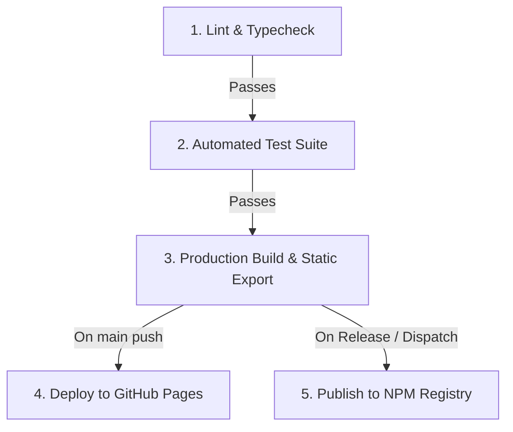

# ⚡ Agent Skills Catalog

<div align="center">

[](https://www.npmjs.com/package/@sriramleo/agent-skills-catalog)
[](LICENSE)
[](CONTRIBUTING.md)
[](https://nodejs.org/)
[](SECURITY.md)
[-purple.svg)](SECURITY.md)

**A 100% Free & Open-Source Universal AI Agent Skills Explorer, Slash Command Catalog & Interactive Dashboard.**  
*Discover, search, categorize, inspect, lint, and run agent skills across Antigravity, Claude Code, Cursor, Codex, Cline, and custom harnesses.*

[Quickstart](#-quickstart) • [Why Open Source?](#-why-agent-skills-catalog) • [Installation](#-installation-options) • [Manual Slash Commands](#-manual-slash-commands-vs-auto-reference) • [Features](#-key-features) • [CLI Cheatsheet](#-cli-usage--cheatsheet) • [Keyboard Shortcuts](#-keyboard-navigation-shortcuts) • [Skill Linter](#-built-in-skill-linter--validator) • [Contributing](#-contributing) • [Security](#-production-security--privacy)

</div>

---

## 🌟 Why Agent Skills Catalog?

As AI coding harnesses multiply (**Google Antigravity**, **Claude Code**, **Cursor**, **OpenAI Codex**, **Cline**), developer skills and system prompt instructions get scattered across hidden directories (`.agents/skills`, `.agents/workflows`, `~/.gemini/config/skills`, `~/.claude/skills`, `.cursor/skills`).

**Agent Skills Catalog** solves this problem by providing a single, unified, local-first open-source hub to:
1. **🔍 Auto-Discover All Skills**: Automatically scan your workspace and global configurations without manual indexing.
2. **⚡ Pick Manual Slash Commands (`/`)**: Easily pick and copy on-demand workflow commands (`/plan`, `/cost-report`, `/jira`, `/quality-gate`) versus auto-loaded reference guidelines (`react-patterns`, `hipaa-compliance`).
3. **📊 Monitor Token Budgets**: See accurate LLM token estimates before loading heavyweight skills into your context window.
4. **🔍 Lint & Health-Check**: Catch broken symlinks, missing frontmatter, and bloated prompt instructions before pushing.
5. **🔒 Strict Security**: 100% read-only, offline, with path-traversal prevention and zero telemetry.

---

## 🚀 Quickstart

Run directly without installing anything using `npx`:

```bash
npx @sriramleo/agent-skills-catalog
```

> ⚡ **What happens:**  
> 1. Automatically scans your workspace and system for installed AI agent skills (`.agents/skills`, `~/.gemini/config/skills`, `~/.claude/skills`, `.cursor/skills`, `.codex/skills`).
> 2. Parses YAML frontmatter, triggers, instructions, required MCP tools, and bundled scripts.
> 3. Launches a lightning-fast local web dashboard and opens your browser at `http://127.0.0.1:4173` in **< 300ms**.

---

## 📦 Installation Options

### 1. Zero-Install with `npx` (Recommended)
Run anytime on any machine:
```bash
npx @sriramleo/agent-skills-catalog
```

### 2. Global Installation
Install globally as a CLI tool:
```bash
npm install -g @sriramleo/agent-skills-catalog

# Then run anywhere:
skills-catalog
# or
agent-skills-catalog --table
```

### 3. Project Developer Dependency
Add to your project's `package.json` for team usage and CI/CD linting:
```bash
npm install --save-dev @sriramleo/agent-skills-catalog
```
Add to your `package.json` scripts:
```json
{
  "scripts": {
    "skills": "skills-catalog",
    "skills:lint": "skills-catalog --lint",
    "skills:export": "skills-catalog --export ./docs/skills"
  }
}
```

### 4. Build from Source (For Contributors)
```bash
git clone https://github.com/sriramleo/agent-skills-catalog.git
cd agent-skills-catalog
npm install
npm run build
npm test
node bin/cli.js
```

---

## ⚡ Manual Slash Commands vs. Auto-Reference

Not all agent skills are used the same way. The catalog automatically distinguishes between:

| Type | Badge | Description | Examples |
| :--- | :--- | :--- | :--- |
| **Manual Slash Command** | `⚡ /command` | User-triggered commands you invoke explicitly in chat. Includes 1-click clipboard copy. | `/plan`, `/cost-report`, `/jira`, `/quality-gate`, `/checkpoint`, `/build-fix` |
| **Auto-Loaded Reference** | `🤖 Auto` | Behavioral guidelines, coding standards, and domain patterns agents consult automatically. | `react-patterns`, `golang-patterns`, `security-review`, `hipaa-compliance` |

In the Web UI header, use the **`All` | `⚡ Manual (/)` | `🤖 Auto-Loaded`** switcher to filter instantly.

In the CLI, filter with:
```bash
npx @sriramleo/agent-skills-catalog --category slash-commands --table
```

---

## ✨ Key Features

- **🌐 Universal Multi-Harness Discovery**: Automatically detects skills across Antigravity / Gemini, Claude Code, Cursor, Codex / OpenAI, Cline, and workspace folders.
- **⭐ Bookmarking & Favorites**: Star your daily-driver skills and filter them instantly (persisted in local storage).
- **⌨️ Power-User Keyboard Navigation**: Navigate with `j`/`k`, open with `Enter`, copy with `c`, star with `s`, and search with `/`.
- **🔗 Slash Command Fast Copy**: Copy `/skill-id` directly to your clipboard with a single click.
- **🔄 Workspace Override Detection**: Identifies when project-level skills override global skills with a clear badge.
- **🛠️ Tools & MCP Server Filtering**: Automatically detects tool requirements (*Playwright, Context7 MCP, Exa Search, Docker, Git, Jira, Postgres, etc.*) and lets you filter by tool.
- **🏷️ Intelligent Categorization**: Auto-sorts skills into structured domains (*Slash Commands, Agent Ops, Testing & QA, Architecture & Backend, Frontend & Design, DevOps & Infra, Security & Compliance, AI & ML, Data & Databases, Docs*).
- **💡 Built-in AI Prompt Studio**: Generates customized prompts for any target agent (*Execute, Review, Plan, Diagnose*).
- **🔍 Built-in Skill Linter & Health Check**: Run `skills-catalog --lint` to validate frontmatter, missing triggers, broken symlinks, and oversized token footprints.
- **📦 Zero-Dependency Static Exporter**: Export a standalone static HTML website ready for GitHub Pages or documentation hosting.
- **🔒 Production-Grade Security**: Strict path traversal validation, read-only local execution, HTML sanitization, and zero telemetry.

---

## ⌨️ Keyboard Navigation Shortcuts

| Key | Action |
| :--- | :--- |
| <kbd>/</kbd> or <kbd>Cmd</kbd>+<kbd>K</kbd> | Focus global live search bar |
| <kbd>j</kbd> or <kbd>↓</kbd> | Move selection to next skill card |
| <kbd>k</kbd> or <kbd>↑</kbd> | Move selection to previous skill card |
| <kbd>Enter</kbd> | Open detailed inspection modal for selected skill |
| <kbd>c</kbd> | Copy AI execution prompt for selected skill |
| <kbd>s</kbd> | Star / Unstar selected skill (toggle favorite) |
| <kbd>Esc</kbd> | Close skill inspection modal |

---

## 💻 CLI Usage & Cheatsheet

### 1. Launch Interactive Web Dashboard
```bash
# Default (opens browser at http://127.0.0.1:4173)
npx @sriramleo/agent-skills-catalog

# Custom port and host
npx @sriramleo/agent-skills-catalog --port 8080 --host 0.0.0.0

# Add custom directories to scan
npx @sriramleo/agent-skills-catalog --dir ./custom-skills /opt/shared-skills
```

### 2. Search & Filter in Terminal
```bash
# Search by keyword or intent
npx @sriramleo/agent-skills-catalog --search react

# View all manual slash commands
npx @sriramleo/agent-skills-catalog --category slash-commands --table

# Filter by category
npx @sriramleo/agent-skills-catalog --category security-compliance --table

# Filter by tool or MCP server
npx @sriramleo/agent-skills-catalog --tool "Playwright" --table

# Print formatted terminal table
npx @sriramleo/agent-skills-catalog --table
```

### 3. Inspect a Specific Skill
```bash
npx @sriramleo/agent-skills-catalog view react-patterns
npx @sriramleo/agent-skills-catalog view continuous-agent-loop
```

### 4. Health Check & Linter
```bash
# Run validation on all skills
npx @sriramleo/agent-skills-catalog --lint
```

### 5. Export Static Website & Documentation
```bash
# Export static web portal + Markdown doc + JSON schema
npx @sriramleo/agent-skills-catalog --export ./public-docs

# Dump raw JSON to stdout (for CI/CD or jq scripts)
npx @sriramleo/agent-skills-catalog --json > skills.json
```

---

## 🔍 Built-in Skill Linter & Validator

Validate that all skills in your repository follow best practices:

```bash
npx @sriramleo/agent-skills-catalog --lint
```

Checks performed:
- `MISSING_FRONTMATTER`: Ensures YAML frontmatter exists.
- `MISSING_DESCRIPTION`: Checks for missing or overly short descriptions.
- `MISSING_WHEN_TO_USE`: Verifies trigger criteria and use cases are clear.
- `OVERSIZED_TOKEN_FOOTPRINT`: Warns if a skill exceeds 8,000 tokens to protect context budget.
- `BROKEN_SYMLINK`: Verifies all symlinks point to existing target files.

---

## 🌐 Interactive Web Dashboard

The web dashboard provides:

1. **Card Grid View**: Visual cards with category badges, token footprints, when-to-use summaries, star button, and slash command copy buttons.
2. **Matrix Data Table**: Fast sortable table for scanning hundreds of skills by name, tokens, category, or assets.
3. **AI Prompt Studio**: Select an action intent (*Execute, Review, Plan, Diagnose*), customize your objective, and copy an optimized instruction prompt.
4. **Skill Detail Modal**:
   - **Overview**: Formatted triggers, conditions, and required MCP tools.
   - **Markdown Reader**: Full `SKILL.md` rendered with syntax highlighting, alerts, and code block copy buttons.
   - **Asset Explorer**: Live viewer for bundled helper scripts (`scripts/*.sh`), reference guides, and schemas.
   - **Metadata**: File paths, symlink origins, token estimates, and raw YAML frontmatter.
5. **Analytics Dashboard**: Breakdown by category, token density, and technology leaderboards.

---

## 🔄 Sequential CI/CD Pipeline

The repository includes a sequential GitHub Actions pipeline in `.github/workflows/ci-cd.yml`:



---

## 🔒 Production Security & Privacy

- **🛡️ Strict Path Traversal Prevention**: Resolves canonical symlinks and verifies all file reads remain within registered skill boundaries (`SecurityGuard.isPathSafe`).
- **📖 100% Read-Only Safety**: Does not modify, delete, or write files to your skill directories.
- **🚫 Zero Telemetry**: Runs entirely local and offline. No tracking, analytics, or remote API calls.
- **🧼 XSS Sanitization**: Markdown output is sanitized using `DOMPurify` before DOM rendering.
- **🛡️ HTTP Security Headers**: Serves with `X-Frame-Options: DENY`, `X-Content-Type-Options: nosniff`, and secure CSP.

---

## 🤝 Contributing

We welcome open-source contributions from the community!

1. **Fork the repository** on GitHub.
2. **Clone your fork** locally:
   ```bash
   git clone https://github.com/sriramleo/agent-skills-catalog.git
   ```
3. **Create a feature branch**:
   ```bash
   git checkout -b feat/my-new-feature
   ```
4. **Make your changes** and verify tests pass:
   ```bash
   npm run build
   npm test
   ```
5. **Submit a Pull Request**! Check out [CONTRIBUTING.md](CONTRIBUTING.md) for full development guidelines.

---

## 📄 License

Distributed under the **MIT License**. See [`LICENSE`](LICENSE) for complete terms. Built with ❤️ for the open-source AI agent community.
