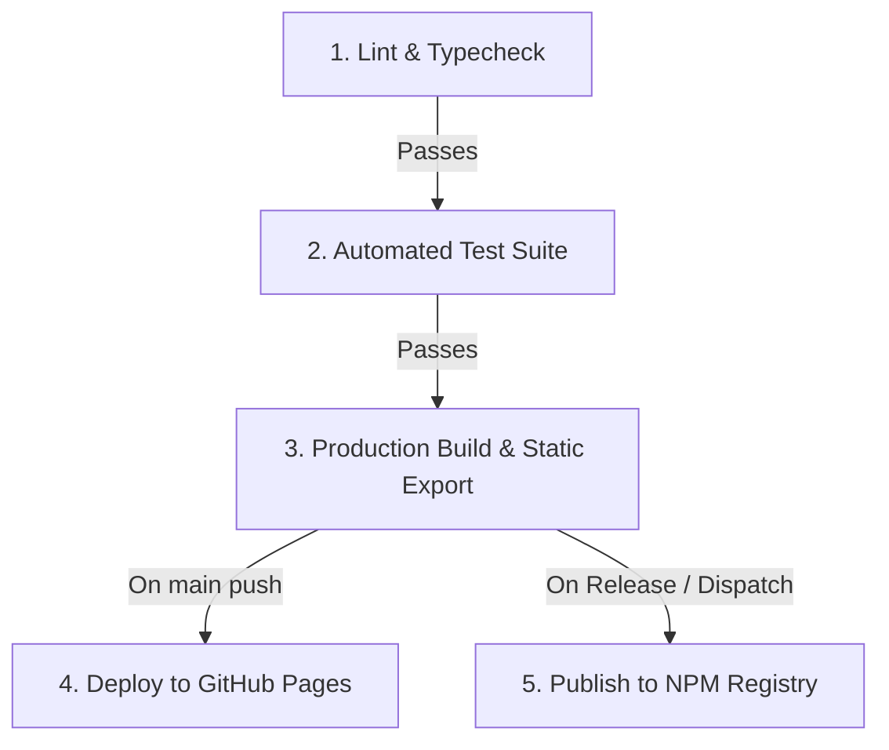

# ⚡ Agent Skills Catalog

<div align="center">

[](https://www.npmjs.com/package/@sriramdevops/agent-skills-catalog)
[](https://opensource.org/licenses/MIT)
[](https://nodejs.org/)
[](SECURITY.md)
[-purple.svg)](SECURITY.md)

**Universal AI Agent Skills Explorer, Search Catalog & Interactive Web Dashboard.**  
*Instantly discover, categorize, inspect, lint, and generate prompts for all your agent skills across Antigravity, Claude Code, Cursor, Codex, Cline, and custom harnesses.*

[Quickstart](#-quickstart) • [Features](#-key-features) • [Harness Support](#-universal-harness-support) • [CLI Commands](#-cli-usage--cheatsheet) • [Keyboard Shortcuts](#-keyboard-navigation-shortcuts) • [Web UI Guide](#-interactive-web-dashboard) • [Skill Linter](#-built-in-skill-linter--validator) • [Static Export](#-static-export--github-pages) • [Security](#-production-security--privacy)

</div>

---

## 🚀 Quickstart

Run directly with `npx` (no installation required):

```bash
npx @sriramdevops/agent-skills-catalog
```

> ⚡ **What happens:**  
> 1. Automatically scans your workspace and system for installed AI agent skills (`.agents/skills`, `~/.gemini/config/skills`, `~/.claude/skills`, `.cursor/skills`, `.codex/skills`).
> 2. Parses YAML frontmatter, triggers, instructions, required MCP tools, and bundled scripts.
> 3. Launches a lightning-fast local web dashboard and opens your browser at `http://127.0.0.1:4173` in **< 300ms**.

---

## ✨ Key Features

- **🌐 Universal Multi-Harness Discovery**: Automatically detects skills across Antigravity / Gemini, Claude Code, Cursor, Codex / OpenAI, Cline, and workspace folders.
- **⭐ Bookmarking & Favorites**: Star your daily-driver skills and filter them instantly (persisted in local storage).
- **⌨️ Power-User Keyboard Navigation**: Navigate with `j`/`k`, open with `Enter`, copy with `c`, star with `s`, and search with `/`.
- **🔗 Slash Command Fast Copy**: Copy `/skill-id` directly to your clipboard with a single click.
- **🔄 Workspace Override Detection**: Identifies when project-level skills override global skills with a clear badge.
- **🛠️ Tools & MCP Server Filtering**: Automatically detects tool requirements (*Playwright, Context7 MCP, Exa Search, Docker, Git, Jira, Postgres, etc.*) and lets you filter by tool.
- **🏷️ Intelligent Categorization**: Auto-sorts skills into 10 structured domains (*Agent Ops, Testing & QA, Architecture & Backend, Frontend & Design, DevOps & Infra, Security & Compliance, AI & ML, Data & Databases, Workflow, and Docs*).
- **💡 Built-in AI Prompt Studio**: Generates customized prompts for any target agent (*Execute, Review, Plan, Diagnose*).
- **🔍 Built-in Skill Linter & Health Check**: Run `npx @sriramdevops/agent-skills-catalog --lint` to validate frontmatter, missing triggers, broken symlinks, and oversized token footprints.
- **📦 Zero-Dependency Static Exporter**: Export a standalone static HTML website ready for GitHub Pages or documentation hosting.
- **🔒 Production-Grade Security**: Strict path traversal validation, read-only local execution, HTML sanitization, and zero telemetry.

---

## ⌨️ Keyboard Navigation Shortcuts

| Key | Action |
| :--- | :--- |
| <kbd>/</kbd> or <kbd>Cmd</kbd>+<kbd>K</kbd> | Focus global live search bar |
| <kbd>j</kbd> or <kbd>↓</kbd> | Move selection to next skill card |
| <kbd>k</kbd> or <kbd>↑</kbd> | Move selection to previous skill card |
| <kbd>Enter</kbd> | Open detailed inspection modal for selected skill |
| <kbd>c</kbd> | Copy AI execution prompt for selected skill |
| <kbd>s</kbd> | Star / Unstar selected skill (toggle favorite) |
| <kbd>Esc</kbd> | Close skill inspection modal |

---

## 💻 CLI Usage & Cheatsheet

### 1. Launch Interactive Web Dashboard
```bash
# Default (opens browser at http://127.0.0.1:4173)
npx @sriramdevops/agent-skills-catalog

# Custom port and host
npx @sriramdevops/agent-skills-catalog --port 8080 --host 0.0.0.0

# Add custom directories to scan
npx @sriramdevops/agent-skills-catalog --dir ./custom-skills /opt/shared-skills
```

### 2. Search & Filter in Terminal
```bash
# Search by keyword or intent
npx @sriramdevops/agent-skills-catalog --search react

# Filter by category
npx @sriramdevops/agent-skills-catalog --category security-compliance --table

# Filter by tool or MCP server
npx @sriramdevops/agent-skills-catalog --tool "Playwright" --table

# Print formatted terminal table
npx @sriramdevops/agent-skills-catalog --table
```

### 3. Inspect a Specific Skill
```bash
npx @sriramdevops/agent-skills-catalog view react-patterns
npx @sriramdevops/agent-skills-catalog view continuous-agent-loop
```

### 4. Health Check & Linter
```bash
# Run validation on all skills
npx @sriramdevops/agent-skills-catalog --lint
```

### 5. Export Static Website & Documentation
```bash
# Export static web portal + Markdown doc + JSON schema
npx @sriramdevops/agent-skills-catalog --export ./public-docs

# Dump raw JSON to stdout (for CI/CD or jq scripts)
npx @sriramdevops/agent-skills-catalog --json > skills.json
```

---

## 🔍 Built-in Skill Linter & Validator

Validate that all skills in your repository follow best practices:

```bash
npx @sriramdevops/agent-skills-catalog --lint
```

Checks performed:
- `MISSING_FRONTMATTER`: Ensures YAML frontmatter exists.
- `MISSING_DESCRIPTION`: Checks for missing or overly short descriptions.
- `MISSING_WHEN_TO_USE`: Verifies trigger criteria and use cases are clear.
- `OVERSIZED_TOKEN_FOOTPRINT`: Warns if a skill exceeds 8,000 tokens to protect context budget.
- `BROKEN_SYMLINK`: Verifies all symlinks point to existing target files.

---

## 🌐 Interactive Web Dashboard

The web dashboard provides:

1. **Card Grid View**: Visual cards with category badges, token footprints, when-to-use summaries, star button, and slash command copy buttons.
2. **Matrix Data Table**: Fast sortable table for scanning hundreds of skills by name, tokens, category, or assets.
3. **AI Prompt Studio**: Select an action intent (*Execute, Review, Plan, Diagnose*), customize your objective, and copy an optimized instruction prompt.
4. **Skill Detail Modal**:
   - **Overview**: Formatted triggers, conditions, and required MCP tools.
   - **Markdown Reader**: Full `SKILL.md` rendered with syntax highlighting, alerts, and code block copy buttons.
   - **Asset Explorer**: Live viewer for bundled helper scripts (`scripts/*.sh`), reference guides, and schemas.
   - **Metadata**: File paths, symlink origins, token estimates, and raw YAML frontmatter.
5. **Analytics Dashboard**: Breakdown by category, token density, and technology leaderboards.

---

## 🔄 Sequential CI/CD Pipeline

The repository includes a sequential GitHub Actions pipeline in `.github/workflows/ci-cd.yml`:



---

## 🔒 Production Security & Privacy

- **🛡️ Strict Path Traversal Prevention**: Resolves canonical symlinks and verifies all file reads remain within registered skill boundaries (`SecurityGuard.isPathSafe`).
- **📖 100% Read-Only Safety**: Does not modify, delete, or write files to your skill directories.
- **🚫 Zero Telemetry**: Runs entirely local and offline. No tracking, analytics, or remote API calls.
- **🧼 XSS Sanitization**: Markdown output is sanitized using `DOMPurify` before DOM rendering.
- **🛡️ HTTP Security Headers**: Serves with `X-Frame-Options: DENY`, `X-Content-Type-Options: nosniff`, and secure CSP.

---

## 📦 Installation Options

### 1. Zero-Install with `npx` (Recommended)
```bash
npx @sriramdevops/agent-skills-catalog
```

### 2. Global Installation
```bash
npm install -g @sriramdevops/agent-skills-catalog
skills-catalog --table
```

### 3. Project Dependency
```bash
npm install --save-dev @sriramdevops/agent-skills-catalog
```

---

## 📄 License

Distributed under the **MIT License**. See [`LICENSE`](LICENSE) for more information.
